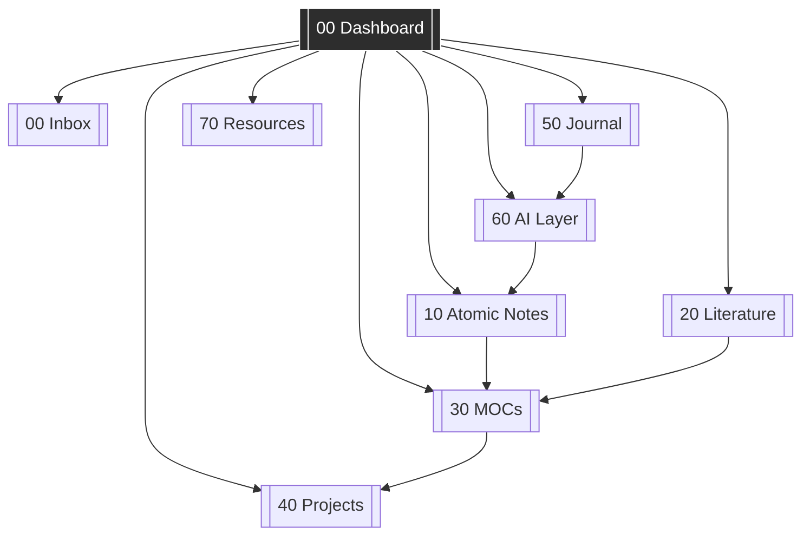

# 00 — Dashboard

> Your daily entry point. Open this first.

---

## 🎯 Active Focus

> _What are you working on right now? Update this weekly._

- [ ] 
- [ ] 
- [ ] 

---

## 📥 Inbox Status

`= this.inbox_count` — items awaiting processing

→ [[00-Inbox]]

---

## 🗓️ Today's Journal

→ [[50-Journal-MOC|Journal MOC]]

---

## 🔥 Active Projects

| Project | MOC | Deadline | Status |
|---------|-----|----------|--------|
| _Add project_ | [[40-Projects-MOC]] | — | 🟡 |

→ [[40-Projects-MOC]]

---

## 📚 Recent Atomic Notes

_Updated manually or via Dataview:_

- 
- 
- 

→ [[10-Atomic-Notes-MOC]]

---

## 🤖 Recent AI Synthesis

- 
- 

→ [[60-AI-MOC]]

---

## 📊 Vault Health

| Metric | Value |
|--------|-------|
| Total notes | _count_ |
| Unprocessed inbox | _count_ |
| Orphan notes | _count_ |
| Notes without tags | _count_ |

---

## ⚡ Quick Actions

- Capture idea → `Ctrl+N` → paste into [[00-Inbox]]
- New atomic note → use template [[TEMPLATE-Atomic-Note]]
- New journal entry → use template [[TEMPLATE-Journal]]
- Process inbox → open [[00-Inbox]], work top to bottom
- Weekly review → see [[70-Resources-MOC#Weekly Review Ritual]]

---

## 🗺️ Domain Map

→ Full visual map: [[30-MOCs-MOC]]
